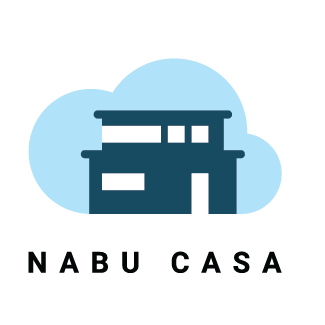

<h2 align="center">Z-Wave device driver written entirely in JavaScript/TypeScript</h2>

  📡 Control your <b>Z-Wave</b> network from Node.js 
  👶 Easy <b>high-level</b> API 
  😊 Just <b>JavaScript</b> (or rather TypeScript), no static library mess 
  🔥 <a href="https://twitter.com/acdlite/status/974390255393505280" target="_blank">blazing</a> fast

## Intro

Z-Wave is an amazing piece of technology, but it is difficult to get started with and develop for.\
**It shouldn't be!** We've got you covered.

Built on Node.js and compatible with all known 500, 700 and 800 series Z-Wave controller hardware adapters, **Z-Wave JS** runs on almost anything with a little bit of computing power and a serial port. Check out the [documentation](https://zwave-js.github.io/zwave-js) to get started!

## Quick Links

  <a href="LICENSE">License</a> &middot;
  <a href="CHANGELOG.md">Changelog</a> &middot;
  <a href="https://zwave-js.github.io/zwave-js/">Documentation</a> &middot;
  <a href="https://devices.zwave-js.io">Device configuration DB</a>

  

## Supporting Z-Wave JS

Started in 2018, **Z-Wave JS** has breathed new life into the Z-Wave ecosystem and is now powering thousands of smart homes all over the world. We strive to build the best open source Z-Wave device driver out there and hold ourselves to the highest standards.

If you'd like to help support the future of the project and make the Z-Wave world a better place, please consider:

- Contributing [configuration files](https://zwave-js.github.io/zwave-js/#/config-files/overview) for new devices, so we have our hands free for the actual development.
- Sending us devices to test. Working with an actual device is much more efficient than trying to debug with logfiles.
- Giving funds by becoming a [supporter](https://github.com/sponsors/AlCalzone). Personally or with your company, monthly or one-time - every little bit helps. [Read more](https://zwave-js.github.io/zwave-js/#/getting-started/integrators.md?id=how-to-support-the-development)...

**Top Sponsors:**

  

