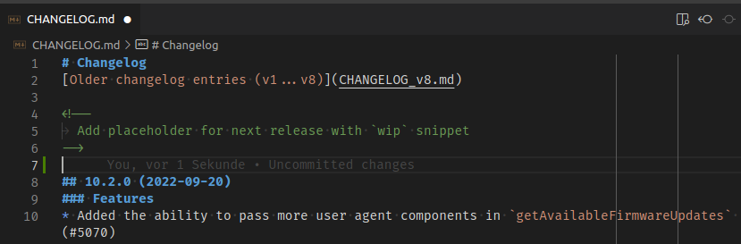
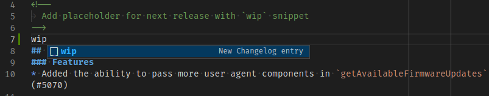
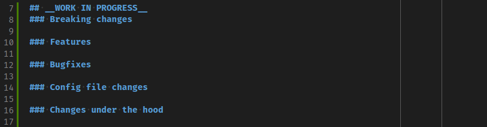
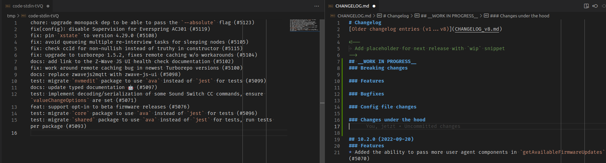

# Releasing `zwave-js` {docsify-ignore-all}

This section is meant as a guide for maintainers on how to release a new version of `zwave-js`. It should not concern anyone else, since releasing requires write access to `master`.

## Prerequisites

- Use VSCode with the recommended extensions
- Have `yarn` installed, see [here](development/intro.md#Prerequisites) for details
- Have the repository checked out locally
- Execute `yarn` to make sure the installed dependencies are up to date. The process will fail otherwise.

## Update the changelog

1. Open `CHANGELOG.md` and insert a newline between the placeholder comment and the start of the previous version:\
   

2. Press `wip`, followed by a <kbd>CTRL</kbd>+<kbd>SPACE</kbd>, <kbd>ENTER</kbd> to auto-complete the changelog placeholder:\
   \
   

3. Open the changes since the last release in a separate VSCode window, by executing this command in a VSCode terminal. You'll need to do this in `git bash` or any other UNIX-like terminal:

   ```bash
   git log --oneline $(git describe --abbrev=0 --tags)...HEAD | cut -d" " -f2- | code -
   ```

   

4. Manually copy the commit messages into the correct section of the changelog:

   - `fix(config)` and `feat(config)` commits go into the `Config file changes` section
   - `test:` commits go into `Changes under the hood`
   - `docs:` commits also go into `Changes under the hood`, or can be left out if they are not important (e.g. auto-generated config updates by the bot)
   - `chore:` commits also go into `Changes under the hood`, or can be left out if they are not important
   - `fix:` commits probably go into `Bugfixes`, but may also be changes under the hood or breaking changes
   - `feat:` commits probably go into `Features`, but may also be changes under the hood or breaking changes

5. Clean up commit new changelog entries (this may make sense to do as part of 4.):

   - Remove the commit prefix like (`fix:` or `feat:`, etc...)
   - Prefix each entry with `*`, so it gets rendered as a list item
   - Capitalize the first letter of the commit message. You can do this with VSCode by selecting the first letter using the multi-cursor selection, pressing <kbd>F1</kbd>, entering `Uppercase` and selecting `Transform to uppercase`
   - Consider rewording the commit message to make it more user-friendly

6. Save and commit your changes to the changelog using the commit message `chore: update changelog`

7. Release the new version by executing `yarn release` in the VSCode terminal and following the instructions.
