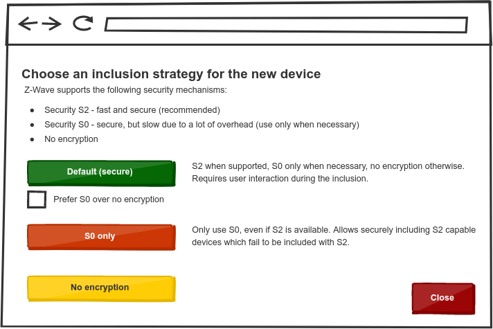
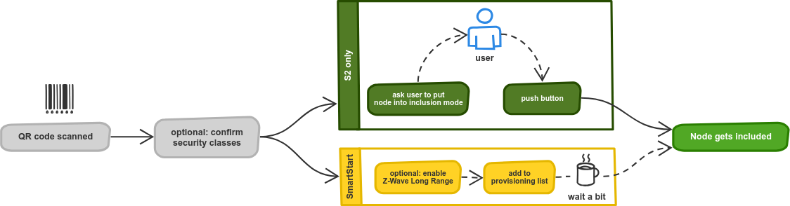

# Supporting Security S2 in Applications

Modern Z-Wave devices are required to support _Security S2_ and unlike _Security S0_, we recommend using it by default. However, supporting it requires some work in your application too, so we've compiled some guidelines here.

The following figure gives you an overview of the (conventional) inclusion process in Z-Wave. A common misconception is that an error causes the inclusion to be aborted. However, Z-Wave JS only learns about a node after it was already included. It will then exchange network keys if secure inclusion is desired and interview the node to determine its capabilities:


## Key management

_Security S2_ supports multiple security classes, allowing different levels of trust and limiting access in case one of the keys ever gets compromised. In order to offer S2 in your application, you have to provide multiple network keys to the driver. Currently, these are:

-   **S2 Access Control** (highest) - Door locks, garage doors, etc.
-   **S2 Authenticated** - Security systems, sensors, lighting, etc.
-   **S2 Unauthenticated** - Like S2 Authenticated, but without verification that the correct device is included
-   **S0 (Legacy)** (lowest) - Legacy door locks without S2 support

> [!ATTENTION] All keys must be Buffers of 16 bytes length with **different** content. Sharing keys between multiple security classes is a security risk!

Code example:

```ts
const driver = new Driver("COM5", {
	securityKeys: {
		// These keys are examples, you should initialize yours with random content
		S2_Unauthenticated: Buffer.from(
			"11223344556677889900aabbccddeeff",
			"hex",
		),
		S2_Authenticated: Buffer.from(
			"10203040506070809000a0b0c0d0e0f0",
			"hex",
		),
		S2_AccessControl: Buffer.from(
			"aaaabbbbccccdddd1111222233334444",
			"hex",
		),
		// S0_Legacy replaces the old networkKey option
		S0_Legacy: Buffer.from("0102030405060708090a0b0c0d0e0f10", "hex"),
	},
	// ... other options
});

// ... start the driver etc.
```

## Inclusion

A high level overview over the available inclusion flows can be seen in the following figure:


Including devices with _Security S2_ has some very specific requirements, which also includes the UI. We've compiled a few guidelines here. We recommend staying close to the shown examples when designing your own UI.

### Conventional inclusion process

The normal inclusion process requires user interaction for choosing keys and verification of the included devices. For this reason, the inclusion process may require you to provide callbacks that `zwave-js` will call to instruct your application to show the inclusion dialogs:

```ts
await driver.controller.beginInclusion({
	strategy: InclusionStrategy.Default,
	userCallbacks: {
		grantSecurityClasses(requested) {
			// Show a dialog that asks the user which security classes to grant
			// Return a Promise that resolves to the chosen security classes when confirmed
			//
			// YOUR IMPLEMENTATION HERE
		},
		validateDSKAndEnterPIN(dsk) {
			// Show a dialog that asks the user to validate the DSK and enter the device PIN
			// Return a Promise that resolves to the entered PIN when confirmed
			//
			// YOUR IMPLEMENTATION HERE
		},
		abort() {
			// Hide the open dialog, notify user that the process was aborted
			//
			// YOUR IMPLEMENTATION HERE
		},
	},
});
```

### Inclusion strategy

Z-Wave JS offers multiple ways to include a device, but we only recommend a few of them. For most use cases, the **default** inclusion strategy should be enough. If you absolutely must, you can force **unencrypted communication**.

Furthermore it has been found that some locks claim to support S2, but don't respond to the key exchange commands. Because it is not possible to try with S0 after S2 has been attempted, an option to **use only S0** must exist.

A UI to choose the inclusion strategy could look as follows:  


### Granting security classes

When using the default strategy and including a device with S2, the user must choose which security classes (network keys) to grant the joining node. Because this can be very confusing unless you have a good understanding of what these things mean, we recommend to explain the different options. A device might not request all possible security classes, so only the ones that are should be selectable.

This could look like this:  


This dialog MUST be shown when `zwave-js` calls the `grantSecurityClasses` user callback.

> [!NOTE] This operation has a timeout of **240 seconds**. If no choice is made within this time, the inclusion process will be aborted. `zwave-js` will call the `abort` user callback, so applications can react.

### Validating the DSK and entering the device PIN

For authentication inclusion (`Authenticated` and `Access Control`), users MUST validate that they are including the correct device.
To do so, the DSK must be presented to the user along with a text field to enter the 5-digit PIN. This PIN is the missing first part of the DSK, so the text field should be presented in a way that makes this obvious. We recommend a UI like this:  


This dialog MUST be shown when `zwave-js` calls the `validateDSKAndEnterPIN` user callback. The missing part of the DSK MUST be labeled "PIN", since this is what's printed on devices users will have.

> [!NOTE] This operation has a timeout of **240 seconds**. If no choice is made within this time, the inclusion process will be aborted. `zwave-js` will call the `abort` user callback, so applications can react.

### Confirming the inclusion process

Security bootstrapping (exchanging keys) happens after a node was included into the network. Since things can go wrong here (including timeouts during user interaction), a node can end up with a lower security class than intended. The `"node added"` event callback contains this infomation:

```ts
driver.controller.on("node added", (node, result) => {
	if (result.lowSecurity) {
		// WARN user about low security
	} else {
		// Confirm node was added as intended
	}
});
```

Therefore, the inclusion result should be displayed and a user MUST be warned about a problem during the inclusion, e.g. by displaying one of these dialogs:


## SmartStart

For modern devices, **SmartStart** makes the inclusion even easier for the user due to not requiring interaction during the inclusion process. SmartStart capable nodes are pre-provisioned through entering their DSK and granting security classes outside of the inclusion process. When a node on the provisioning list announces itself, it will automatically be included in the network within a couple of minutes. A UI to manage the provisioning list could look like this:


> [!NOTE] Confirming the inclusion process like with normal S2 inclusion is recommended, so users can react to a failed bootstrapping attempt.

## Using QR codes to include devices

Scanning a QR code can further simplify the inclusion process, because it limits the user interaction to scanning the code (and pushing a button for conventional inclusion):



For more details see [Parse S2 or SmartStart QR code strings](api/utils.md#parse-s2-or-smartstart-qr-code-strings).
